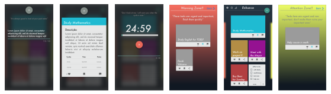
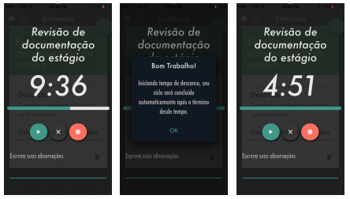
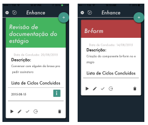
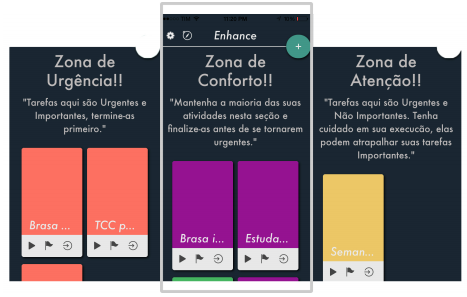

# Enhance - Mobile App for time management, activity execution, and planning.

Enhance app is my bacharelor's final project for evaluating my undergrad. It is an app for managing time of work and monthly activities.  
This app was created using the first version of the Ionic Framework, being the intro of my career as mobile engineer.

### Apps's background methodologies
Enhance was built on top of strong time management and activity planning strategies. They are briefly introduced below:

1. Pomodoro Technique (https://francescocirillo.com/pages/pomodoro-technique):
It helps you control the time of your work, keeping you out of distractions for a determined time. Cycles of 25 minutes of non-stop work with 5 minutes of recover are the base of this technique famous worldwide. 
With the enhance app, the user can run pomodoros that follows the technique's rules, the app also helps the user to find the right amount of cycles needed for each activity added and tracks how many pomodoros were actually necessary to finish it.

2. First Things First (https://www.amazon.com.br/First-Things-Stephen-R-Covey/dp/0684802031)
What are the most important things in your life? Do they get as much care, emphasis, and time as you'd like to give them? Far from the traditional "be-more-efficient" time-management book with shortcut techniques, First Things First shows you how to look at your use of time totally differently. Using this book will help you create balance between your personal and professional responsibilities by putting first things first and acting on them. Covey teaches an organizing process that helps you categorize tasks so you focus on what is important, not merely what is urgent. -- Stephen Covey.

#### Layout Overview

#### Pomodoro Cycles and Task Cards

#### First Things First Quadrants

